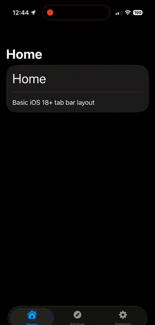

<h1 align="center">UnionTabView</h1>

<p align="center">
  
</p>

A SwiftUI package that gives you iOS 26's **Liquid Glass tab bar** with fully custom tab item views.

The standard iOS 26 `TabView` only supports system-provided tab items. This package lets you use the beautiful floating glass effect while rendering **any custom SwiftUI view** for each tab—icons, labels, badges, animations, whatever you want.

## Why Use This?

On iOS 26, Apple introduced a gorgeous floating glass tab bar with a sliding selection indicator. But there's a catch: you're limited to the system's `Tab` API with predefined icons and labels.

**UnionTabView solves this** by recreating the liquid glass aesthetic with full `@ViewBuilder` support for tab items. You get:

- ✨ **Liquid Glass Effect** — The beautiful `glassEffect(.regular.interactive())` capsule
- 🎚️ **Native Sliding Indicator** — Smooth animated selection via `UISegmentedControl`
- 🎨 **Custom Tab Items** — Any SwiftUI view: custom icons, animated badges, profile avatars, etc.
- 📱 **Adaptive** — Falls back to a clean custom tab bar on iOS 17-25

## Documentation

📚 **[Full API Reference](https://www.swiftipedia.org/documentation/uniontabview)**

### Featured Guides

**[How to Put Profile Pictures in Liquid Glass Tab Bar](https://www.swiftipedia.org/documentation/uniontabview/customviewsinliquidglasstabbars)** - The complete guide to adding custom views, profile pictures, and custom icons to iOS 26's liquid glass tab bar—the limitation Apple doesn't tell you about and how to solve it.

## Requirements

- iOS 17.0+
- Swift 6.0+
- Xcode 16+

## Installation

Add this package to your Xcode project using Swift Package Manager:

```
https://github.com/unionst/union-tab-view.git
```

## Usage

```swift
import UnionTabView

enum Tab { case home, settings }

struct ContentView: View {
    @State private var tab: Tab = .home
    
    var body: some View {
        UnionTabView(selection: $tab, tabs: [.home, .settings]) {
            Text("Home").unionTab(Tab.home)
            Text("Settings").unionTab(Tab.settings)
        } item: { tab, isSelected in
            Image(systemName: tab == .home ? "house.fill" : "gear")
                .foregroundStyle(isSelected ? .primary : .secondary)
        }
    }
}
```

### Parameters

| Parameter | Type | Description |
|-----------|------|-------------|
| `selection` | `Binding<Tab>` | Binding to the currently selected tab |
| `tabs` | `[Tab]` | Array of all tabs in display order |
| `content` | `@ViewBuilder` | The tab content views |
| `item` | `@ViewBuilder` | Closure to render each tab item |

### The `.unionTab()` Modifier

Apply this modifier to each tab's content view:

```swift
NavigationStack { HomeView() }
    .unionTab(RootTab.home)
```

On iOS 26+, this modifier:
- Hides the system tab bar
- Adds proper safe area spacing for the floating tab bar

On iOS 17-25, it simply applies the `.tag()` modifier.

## Customization Examples

### Icon-Only Tab Bar

```swift
UnionTabView(selection: $selectedTab, tabs: RootTab.allCases) {
    // content...
} item: { tab, isSelected in
    Image(systemName: tab.icon)
        .font(.title2)
        .foregroundStyle(isSelected ? .blue : .gray)
}
```

### Animated Selection with Symbol Effects

```swift
UnionTabView(selection: $selectedTab, tabs: RootTab.allCases) {
    // content...
} item: { tab, isSelected in
    VStack(spacing: 6) {
        Image(systemName: tab.icon)
            .font(.system(size: 22))
            .symbolEffect(.bounce, value: isSelected)
        
        Circle()
            .fill(isSelected ? .blue : .clear)
            .frame(width: 5, height: 5)
    }
    .foregroundStyle(isSelected ? .blue : .secondary)
}
```

### Custom Pill Selection Style

```swift
UnionTabView(selection: $selectedTab, tabs: RootTab.allCases) {
    // content...
} item: { tab, isSelected in
    HStack(spacing: 6) {
        Image(systemName: tab.icon)
            .font(.system(size: 18, weight: .semibold))
        
        if isSelected {
            Text(tab.title)
                .font(.system(size: 14, weight: .semibold))
        }
    }
    .foregroundStyle(isSelected ? .white : .secondary)
    .padding(.horizontal, isSelected ? 16 : 12)
    .padding(.vertical, 10)
    .background {
        if isSelected {
            Capsule().fill(.blue.gradient)
        }
    }
}
```

## Architecture

The package uses a `UISegmentedControl` as the underlying selection mechanism, which provides:

1. **Native sliding animation** - The selection indicator slides smoothly between segments
2. **Haptic feedback** - System haptics on selection
3. **Accessibility support** - Full VoiceOver compatibility

The segmented control is styled to be invisible (empty string segments, clear background) while the custom tab item views are rendered on top with `allowsHitTesting(false)`, allowing touch events to pass through to the control.

## License

MIT

## Author

Ben Sage • [Union St](https://unionst.com)
